# 2025年15款全球最佳电脑监控软件汇总(最新整理)

现代工作环境中，远程办公和员工生产力管理变得越来越重要。无论是企业管理者希望了解员工工作效率，还是家长需要监督孩子的上网行为，选择一款功能全面、操作简便的监控软件至关重要。本文将为您详细介绍15款目前市场上最具代表性的电脑监控软件，帮助您快速找到最适合的解决方案。

## **[SentryPC](https://www.sentrypc.com)**

完全基于云端的综合监控平台，专为企业和家庭用户打造。

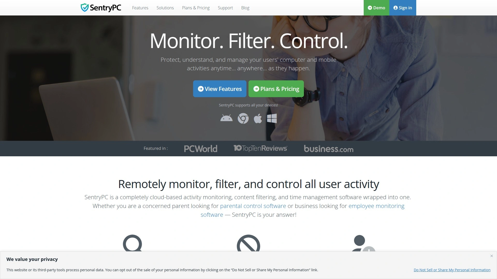

SentryPC以其完全云端化的架构脱颖而出，提供实时活动监控、内容过滤和时间管理三大核心功能。该软件支持Windows、Mac、Android和Chromebook等多个平台，用户可以通过任何联网设备随时查看监控数据和调整设置。

其独特之处在于完全隐形运行模式，监控对象无法察觉软件的存在。系统会自动记录所有用户活动，包括键盘输入、网站访问、应用程序使用情况，并生成详细的屏幕截图。对于企业用户，SentryPC提供强大的访问控制功能，可以远程禁用计算机或限制特定功能使用。

定价策略十分灵活，年费从59.95美元起，支持中央化管理多台设备，特别适合需要同时监控多个员工或家庭成员的用户场景。

## **[Teramind](https://www.teramind.co)**

以安全威胁防护见长的企业级监控解决方案。

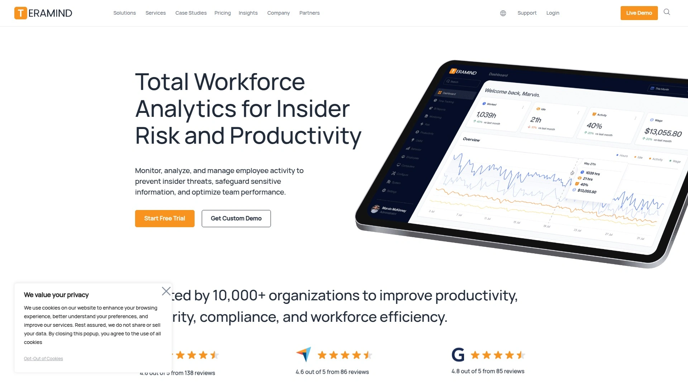

Teramind专门针对企业内部威胁检测和数据丢失防护而设计，提供超过200种预定义策略模板。该软件采用行为分析技术识别潜在安全风险，可以进行屏幕录制、键盘记录以及应用程序使用监控。

特别值得关注的是，Teramind不仅提供基础监控功能，还具备动态风险评分和异常检测能力。其DLP（数据丢失防护）计划符合HIPAA和GDPR等法规要求，适合对数据安全有严格要求的行业。

定价从每月每用户10美元起，提供Starter、UAM、DLP和Enterprise四个版本，最低需要5个用户许可证。

## **[ActivTrak](https://www.activtrak.com)**

注重员工体验的生产力分析平台。

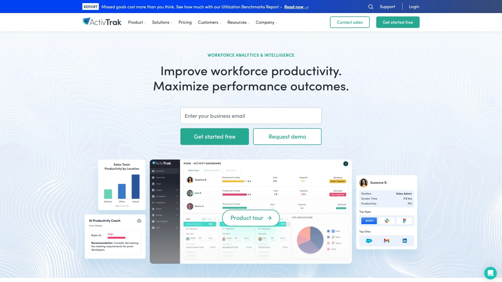

ActivTrak采用员工友好的监控方式，通过匿名化数据保护员工隐私，同时提供详细的生产力分析。该软件的突出特点是其免费版本可以监控最多3名员工，对于小团队来说是理想选择。

平台提供直观的仪表板，管理者可以轻松追踪员工活动、识别趋势并改善团队表现。ActivTrak在平衡监控需求与员工隐私方面表现出色，通过可定制设置让用户自主控制监控程度。

软件提供实时生产力指标、异常活动检测以及20多种可定制报告，帮助企业优化工作流程和资源配置。

## **[Hubstaff](https://hubstaff.com)**

时间追踪与生产力监控的完美结合。

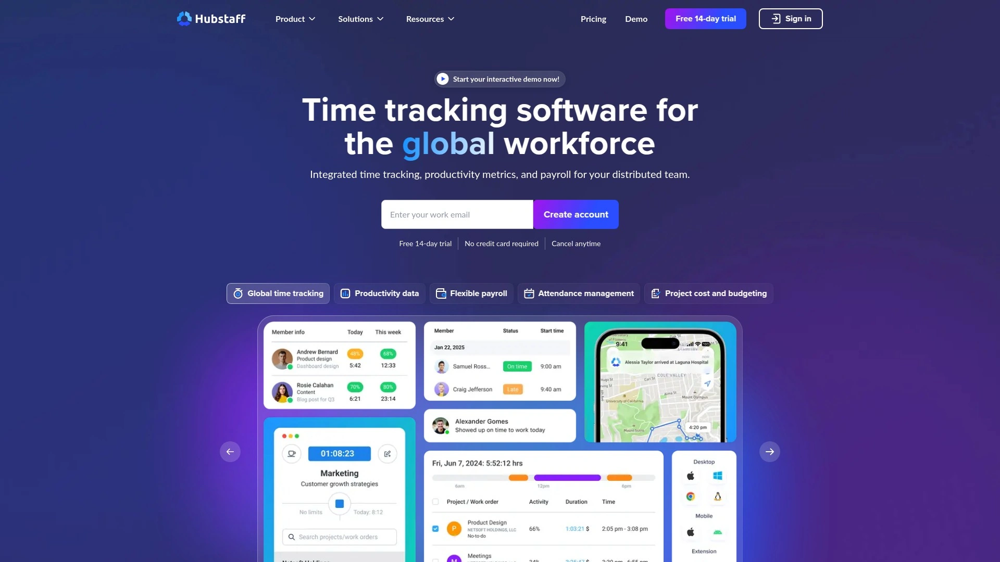

Hubstaff以透明的员工监控著称，仅在员工工作时间内进行数据收集。该软件特别适合管理全球化远程团队，提供时间追踪、活动级别监控和可选截图功能。

其核心优势在于强大的集成能力，可以与Asana、Trello、QuickBooks等热门工具无缝对接。Hubstaff还提供GPS追踪和地理围栏功能，特别适合管理外勤团队。

该软件注重隐私保护，不进行键盘记录，不监控电子邮件，也不访问摄像头，数据收集在计时器停止后立即终止。定价策略灵活，包含免费版本。

## **[Time Doctor](https://www.timedoctor.com)**

专业的时间追踪和生产力优化工具。

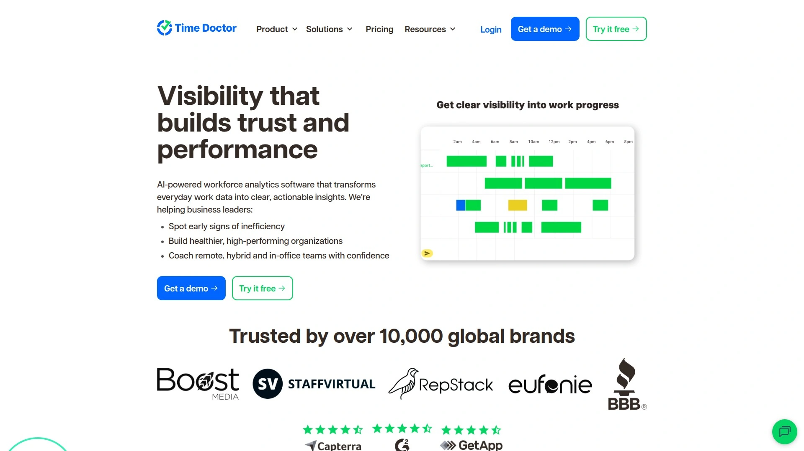

Time Doctor由Staff.com创始人于2012年推出，是一款功能丰富的员工监控工具，包含键盘记录、截图和网络使用追踪功能。该软件特别适合需要按小时计费的企业和自由职业者。

软件提供详细的生产力报告、应用程序和网站使用追踪、聊天监控以及基于时间的报告功能。Time Doctor的独特之处在于其工作生活平衡报告仪表板，可以分析员工行为并在员工面临倦怠风险时发出预警。

定价从每月7美元起，支持多种支付周期和货币选择，与Gusto等顶级薪资软件集成良好。

## **[DeskTime](https://desktime.com)**

自动化时间追踪的领先者。

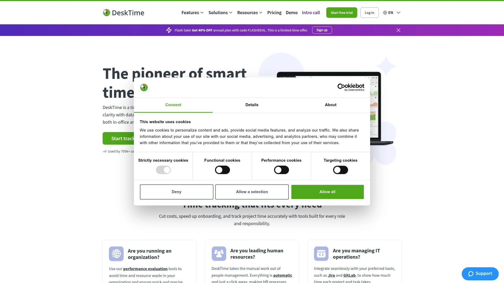

DeskTime以其自动时间追踪技术闻名，无需手动操作即可精确记录工作时间。该软件在计算机开启时自动开始追踪，空闲超过3分钟时自动停止，确保数据准确性。

平台提供URL和文档追踪、报告工具、排班管理和截图功能。DeskTime的生产力计算基于管理员指定的生产性和非生产性应用程序，为团队管理提供清晰的效率指标。

该软件特别适合需要监控远程员工的企业，提供14天免费试用，正式版本价格合理，支持多种部署方式。

## **[CleverControl](https://clevercontrol.com)**

AI驱动的智能员工监控平台。

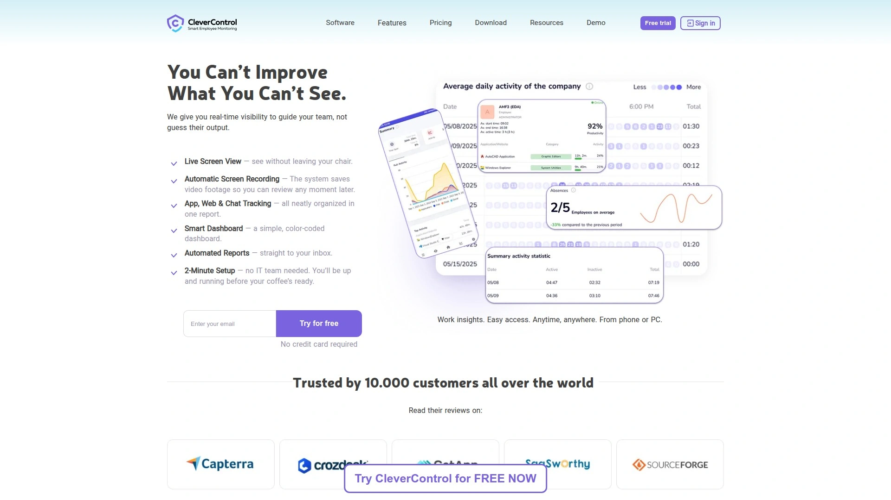

CleverControl是首款运用AI技术的员工监控解决方案，显著减少管理者分析员工生产力所需的时间。该软件提供人脸识别、屏幕录制、实时查看等高级功能。

其AI评分系统可以自动分析活动日志，客观评估每位员工的生产力水平，帮助识别改进重点。软件还具备独特的自我监控功能，允许员工查看自己的生产力统计数据。

CleverControl提供云端版本和本地部署版本，月费从4.70美元起，适合各种规模的企业需求。

## **[Kickidler](https://www.kickidler.com)**

视觉监控工具的领导者。

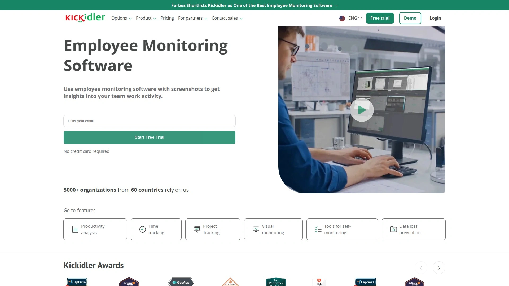

Kickidler专注于视觉监控和用户活动追踪，为各种规模的企业客户提供服务。该软件支持实时计算机监控、屏幕截图录制、生产力分析、时间追踪和违规监控等功能。

其独特的数据泄露防护套件帮助企业保护重要数据，可以监控和控制组织内的文件传输，防止未授权的屏幕捕获，并识别异常的用户行为模式。

月费从6.99美元起，支持月付、季付、年付等多种付款方式，提供邮件、在线聊天和在线文档等多种支持渠道。

## **[Monitask](https://www.monitask.com)**

用户友好的活动监控工具。

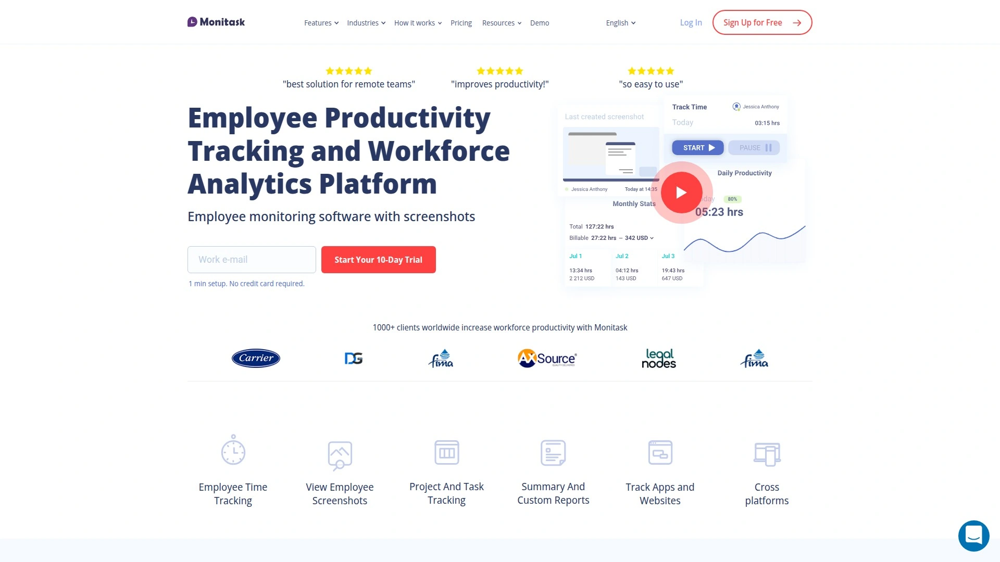

Monitask是一款注重用户体验的活动监控工具，记录计算机活动并生成工作时间、用户生产力等详细报告。该软件的突出特点是完全不进行键盘监控，更好地保护用户隐私。

软件提供隐形监控模式，可以在后台静默运行而不被用户察觉。Monitask每几分钟最多捕获三张截图，同时追踪网站访问和员工活动情况，确保远程员工在工作时间内保持专注。

该平台与Asana、Trello等热门工作管理系统集成良好，特别适合现代化的远程工作环境。

## **[WorkTime](https://www.worktime.com)**

非侵入式的纯生产力监控软件。

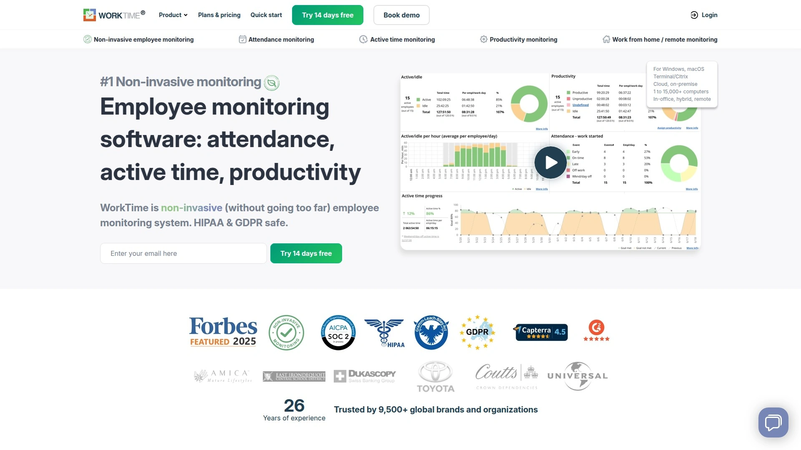

WorkTime是市场上独特的非侵入式纯生产力监控软件，专为企业监控员工生产力水平而设计。该软件监控出勤、活跃/空闲时间、加班时间、生产力以及软件和网络使用情况。

用户满意度极高，客户续费计划达到100%，推荐可能性达到92%。WorkTime的情感足迹净值为+97，表明用户对该产品持非常积极的态度。

该软件提供键盘记录、截图、仪表板和报告等核心功能，致力于帮助企业创新、持续改进产品质量并提升性能。

## **[RescueTime](https://www.rescuetime.com)**

个人生产力优化的智能助手。

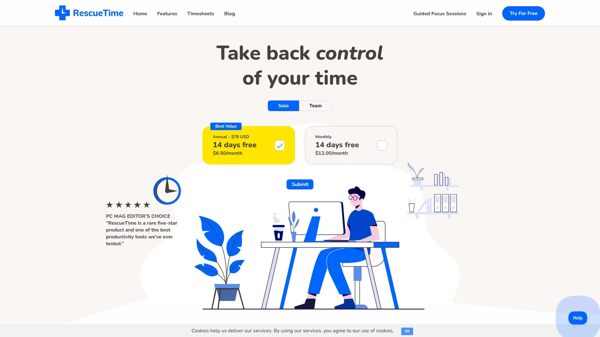

RescueTime是一款生产力工具，自动追踪用户在网站和应用程序上花费的时间，提供时间分析、时间表和专注时间功能。该软件在后台运行，捕获用户跨网站和应用程序的时间使用情况。

软件提供目标设置和专注时间功能来提升生产力和时间管理能力。RescueTime的专注会话可以通过阻止分散注意力的网站和应用程序来保持生产力。

月费从6.50美元起，为个人用户提供免费版本，团队版功能相对有限但足以满足基本需求。

## **[Qustodio](https://www.qustodio.com)**

全方位的家长控制和数字健康解决方案。

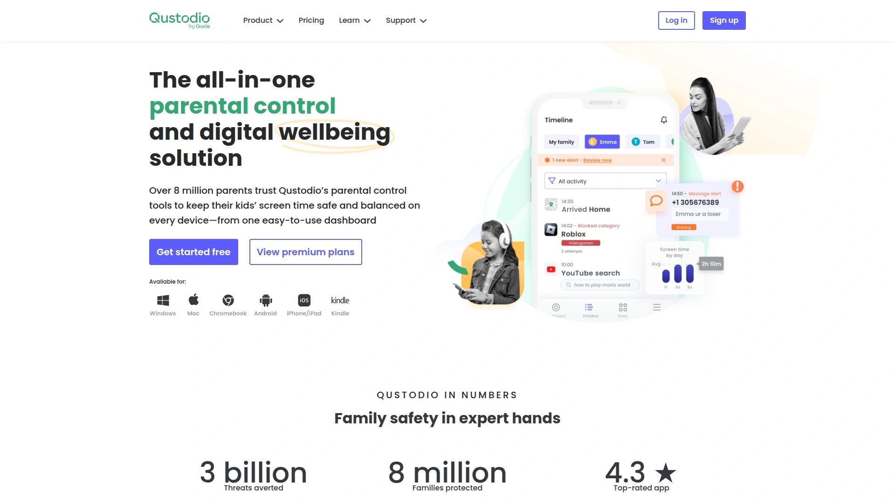

Qustodio获得PC Mag编辑选择奖，是一款让育儿更轻松的家长控制应用，提供每日屏幕时间限制、应用阻止、儿童追踪、AI驱动的搜索和消息警报等功能。

该软件支持网络过滤、游戏和应用程序阻止、安全搜索执行，同时提供全面的可见性功能，包括搜索警报、短信消息警报和社交媒体监控警报。超过800万家长信任Qustodio的家长控制工具。

Qustodio提供基础免费版本和高级付费版本，支持多平台使用，包括Android、iOS、Windows、Mac等主流操作系统。

## **[Norton Family](https://us.norton.com/products/norton-family)**

安全可靠的家长控制软件。

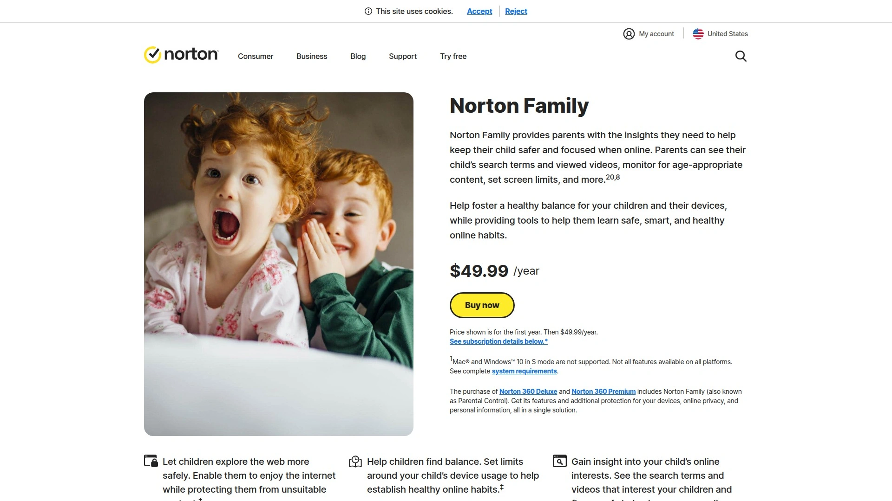

Norton Family提供在线安全工具，用于过滤内容和为儿童设置更健康的界限。该软件帮助家长保护儿童远离不当内容，让他们在健康的边界内访问网站、观看视频和使用移动应用程序。

核心功能包括应用程序监督、网络浏览控制、视频监督、网络搜索管理和位置监督。Norton Family允许家长查看孩子的Android或iOS设备30天的位置历史记录。

该软件支持即时锁定功能，可以帮助孩子休息或专注于家庭聚餐，同时保持家庭成员之间的正常联系。

## **[iMonitor EAM](https://www.imonitorsoft.com)**

企业级员工活动监控系统。

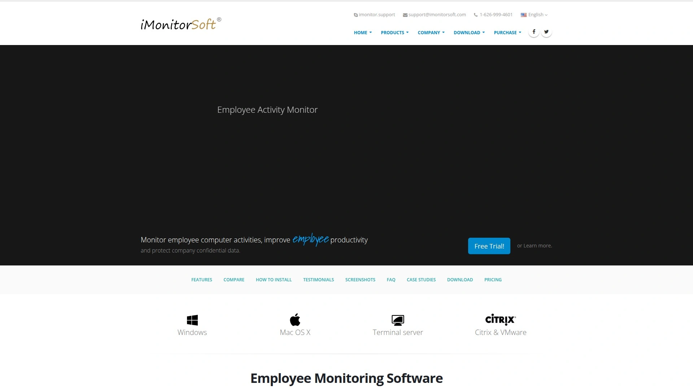

iMonitor Employee Activity Monitor（EAM）旨在帮助组织改善员工生产力并保护企业机密信息。该系统可以从一个中央服务器监控多达1000台计算机，并可以按部门或位置对计算机进行分组。

平台能够监控各种活动，包括键盘输入、剪贴板活动、屏幕截图、文档活动、打印、电子邮件、在线存储使用、网站访问、在线搜索、下载、应用程序使用时间、可移动存储使用、网络流量和系统事件。

该软件的附加功能包括同时运行多达十个不同远程桌面以实时监控员工工作的能力，以及为特定活动设置实时警报的功能。

## **[InterGuard](https://www.interguard.com)**

数据安全防护的专业解决方案。

InterGuard提供旨在记录、警报、阻止和响应用户活动的软件，以保护业务数据、维护生产力并确保数据和安全保护的法律合规性。该软件将用户活动监控、数据丢失防护和事件响应的不同方面整合到单一软件管理平台中。

InterGuard自动监控所有用户活动，并使该数据可用于搜索、警报和报告。参数由公司的数据访问政策和协议确定，可能威胁数据安全的未授权进程可以被阻止。

该软件特别适合需要远程访问丢失或被盗笔记本电脑的企业，可以远程检索文件、删除数据或锁定设备以防止未授权访问。

## 常见问题解答

**这些监控软件是否支持多平台使用？**

大部分现代监控软件都支持跨平台使用，包括Windows、Mac、Android、iOS等主流操作系统。像SentryPC、Qustodio这样的云端解决方案可以从任何联网设备进行管理，确保用户随时随地掌控监控情况。

**员工监控软件的法律合规性如何保证？**

合规的员工监控软件通常需要事先告知员工并获得同意，同时符合GDPR、HIPAA等数据保护法规。像Teramind这样的企业级解决方案专门设计了符合各种法规要求的功能模块，确保企业在监控过程中不违反相关法律。

**如何平衡监控需求与隐私保护？**

现代监控软件越来越注重隐私保护，提供可定制的监控程度。例如Hubstaff不进行键盘记录和邮件监控，ActivTrak通过数据匿名化保护员工隐私。用户可以根据实际需求调整监控功能的开启程度。

选择适合的电脑监控软件需要综合考虑功能需求、预算限制、隐私要求和合规性等多个因素。[SentryPC](https://www.sentrypc.com)作为云端化程度最高的综合解决方案，特别适合需要远程管理和跨平台监控的用户场景，其完善的功能体系和灵活的定价策略使其成为首选方案。
